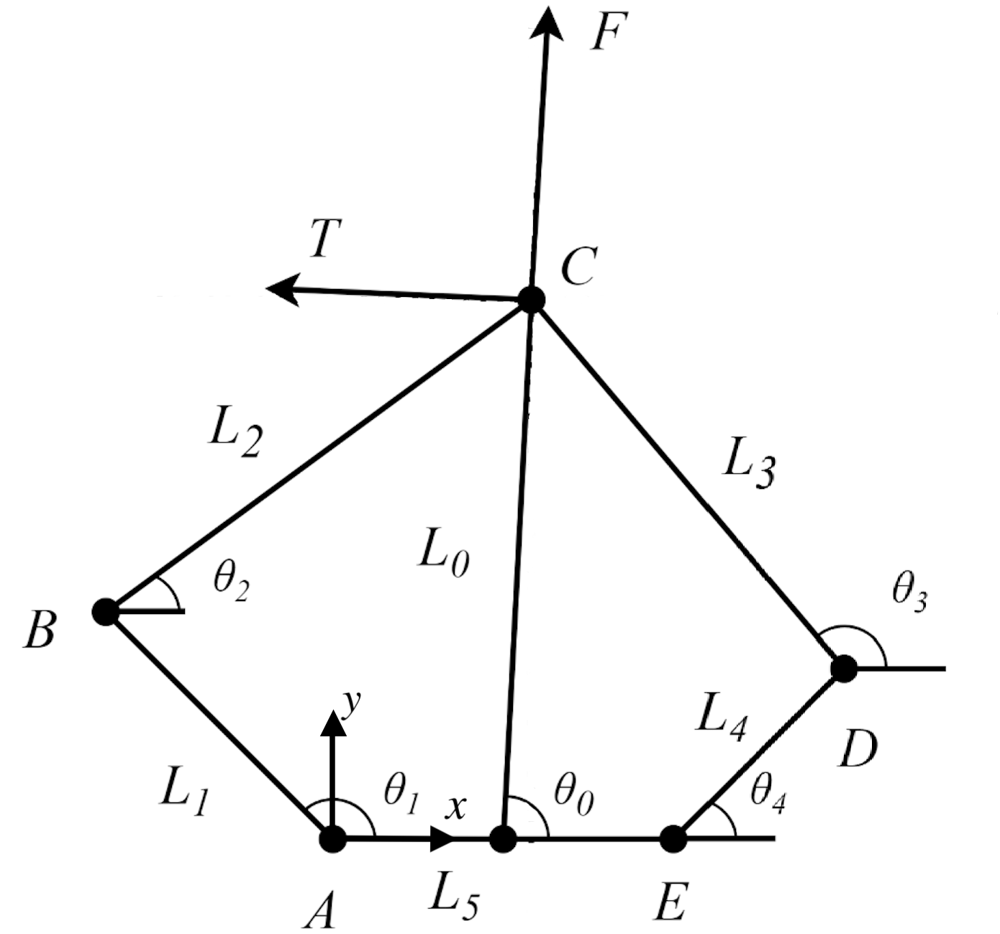

<div align="center">

# Five Bar Inverse Kinematics and Virtual Model Control
YiChun (Jim) Liao
</div>

:green_circle:[1. Find leg length and θ₀](#1-find-leg-length-and-θ)\
:green_circle:[2. Find equations for velocity](#2-find-equations-for-velocity)\
:green_circle:[3. Virtual Model Control](#3-virtual-model-control)

<div align="center">

## 1. Find leg length and θ₀


##

To find $\displaystyle \theta_2$, we can these 2 equations. LHS and RHS represent same point.
<div id="1.1"></div>

```math
\Large
\begin{cases} 
x_B + L_2\cos(\theta_2) = x_D + L_3 \cos(\theta_3) \\
y_B + L_2\sin(\theta_2) = x_D + L_3 \sin(\theta_3)
\end{cases} \tag{1.1}
```
<div id="1.2"></div>

##

Move $x_D$ to the left side and Square both sides
```math
\Large \tag*{} 
\begin{cases} 
(x_B + L_2\cos(\theta_2)-x_D)^2 = (L_3 \cos(\theta_3))^2 \\
(y_B + L_2\sin(\theta_2)-y_D)^2 = (L_3 \sin(\theta_3))^2
\end{cases} 
```
##
Solve [(1.2)](#1.2)
<div id="1.3"></div>

```math
\Large
A\cdot cos(\theta_2) + B\cdot sin(\theta_2) = C \tag{1.3}
```
```math
\Large\tag*{} 
\begin{cases} 
A = 2 \cdot L_2 \cdot (x_B - x_D) \\
B = 2 \cdot L_2 \cdot (y_B - y_D) \\
C = L_3^2 - L_{BD}^2 - L_2^2 \\
L_{BD} = \sqrt{(x_B - x_D)^2 + (y_B - y_D)^2}
\end{cases} 
```
## 
Solve [(1.3)](#1.3)
```math
\Large \tag{1.4}
\begin{cases} 
\theta_2 = 2\cdot tan^{-1}(\frac{B\pm \sqrt{A^2+B^2-C^2}}{A+C})\\
\theta_3 = 2\cdot tan^{-1}(\frac{(-B)\pm \sqrt{A^2+B^2-C^2}}{(-A)+C})
\end{cases} 
```

##
We can find the (x,y) for point C and solve the $L_0$,
```math
\Large\tag{1.6}
\begin{cases} 
x_C = L_1\cos(\theta_1) + L_2 \cos(\theta_2) \\
y_C = L_1\sin(\theta_1) + L_2 \sin(\theta_2)
\end{cases} 
```
<div id="1.7"></div>

##
```math
\Large\tag{1.7}
\begin{cases} 
L_0      = \sqrt{(x_C - \frac{L_5}{2})^2 + y_C^2} \\
\theta_0 = tan^{-1}(\frac{y_C}{x_C-\frac{L_5}{2}})
\end{cases} 
```
##
Since we want the $\theta_0$ + $\theta_b$

```math
\tag{1.8}
\begin{align}
\theta_{final} = (\theta_0 - \theta_0 + \pi)\mod(2\pi)
\end{align}
```

Note: This function depends on the direction you set for your IMU and $\theta_0$
## 2. Find equations for velocity

We now have

```math 
\Large \tag*{} \theta = \begin{bmatrix} \theta_0 \\ \theta_1 \\ \theta_2 \\ \theta_3 \\ \theta_4 \end{bmatrix}
```
##
From the encoder, we can get $\dot{\theta_1}$ and $\dot{\theta_4}$. We have a great idea that we can use encoder data instead of the derivative of angle data to find the $\dot\theta_0$

Find the derivative of [(1.1)](#1.1) to find $\dot\theta_2$

```math
\Large\tag{2.1}
\begin{cases} 
\dot x_B - L_2\dot \theta_2\sin(\theta_2) = \dot x_D - L_3\dot \theta_3 \sin(\theta_3) \\
\dot y_B + L_2\dot \theta_2\cos(\theta_2) = \dot y_D + L_3\dot \theta_3 \cos(\theta_3)
\end{cases} 
```
##
We can get:

```math
\Large\tag{2.2}
\dot \theta_2 = \frac{(\dot x_B -\dot x_D )\cos(\theta_3) + (\dot y_B -\dot y_D )\sin(\theta_3)}{L_2\sin(\theta2 -\theta3)}
```

```math
\Large \tag*{}
\begin{cases}
\dot x_B = -L_1\dot \theta_1\sin(\theta_1) \\
\dot y_B = L_1\dot \theta_1\cos(\theta_1) \\
\dot x_D = -L_4\dot \theta_4\sin(\theta_4) \\
\dot y_D = L_4\dot \theta_4\cos(\theta_4) \end{cases} 
```
##
Then find $\dot x_C$ and $\dot y_C$: 

<div id="2.3"></div>

```math
\Large\tag{2.3}
\begin{cases} 
\dot x_C = -L_1\dot \theta_1\sin(\theta_1) - L_2\dot \theta_2 \sin(\theta_2) \\
\dot y_C = L_1\dot \theta_1\cos(\theta_1) + L_2\dot \theta_2 \cos(\theta_2)
\end{cases} 
```
##
From [(1.7)](#1.7) we can get: 
```math
\Large\tag{2.4}
\begin{cases}
\dot \theta_0 = \frac{(x_C-\frac{L_5}{2})\dot y_C + y_C\dot x_C}{(x_C-\frac{L_5}{2})^2+y_C^2} \\
\dot L_0 = \frac{(x_C-\frac{L_5}{2})\cdot \dot x_C + y_C \cdot \dot y_C}{L_0}
\end{cases} 
```

Note:  $L_2 = L_3$ and $L_1 = L_4$ in many design cases. 

##
Since we want the $\theta_0$ + $\theta_b$

```math
\tag{2.5}
\begin{align}
\dot \theta_{final} = (\dot \theta_0 - \dot \theta_b)
\end{align}
```

Note: This function depends on the direction you set for your IMU and $\dot \theta_0$
##
## 3. Virtual Model Control
Virtual model control is a motion control framework which uses virtual components to calculate virtual forces. By this, we can get a why to get motors' torques for the controller's output. 

In the [Balancing robot controller](./Balancing_controller) we get the $\vec F$ and $T$

Therefore, we need to get a matrix to find torques of 2 motors control $\theta_1$ and $\theta_4$
##
First we set the virtural force

```math
\large \tag{3.1}
F =
\begin{bmatrix}
\vec F\\
 T
\end{bmatrix}
= J_{final} \begin{bmatrix}
T_1\\
T_4
\end{bmatrix}
```
##
We can find the Jacobian matirx form either angle-position or angular velocity-velocity. Both methods will give the same $J_{final}$ matrix.

However, the Jacobian matrix derived using position will be really long due to the complexity of the trigonometric relationships involved.

Therefore, ending up using velocity to derive $J$ matrix.
##
From the [Find euqations for velocity](#2-find-equations-for-velocity), we got the relation between angular velocity and velocity. 

```math
\large \tag{3.3}
\begin{bmatrix}
\dot x_C\\
\dot y_C
\end{bmatrix}=
J_{xy}\begin{bmatrix}
\dot \theta_1\\
\dot \theta_4
\end{bmatrix}
```
##
We can use MATLAB to help finding the relation matrix $J_{xy}$

```math
\large \tag{3.2}
J_{xy}=
\begin{bmatrix}
\frac{L_1*sin(\theta_3)*sin(\theta_1 - \theta_2)}{sin(\theta_2 - \theta_3)}&  \frac{L_4*sin(\theta_2)*sin(\theta_3 - \theta_4)}{sin(\theta_2 - \theta_3)}\\
-\frac{L_1*cos(\theta_3)*sin(\theta_1 - \theta_2)}{sin(\theta_2 - \theta_3)}& -\frac{L_4*cos(\theta_2)*sin(\theta_3 - \theta_4)}{sin(\theta_2 - \theta_3)}
\end{bmatrix}
```

Note: the [MATLAB code](#matlab-code)
##
We want convert force back to torque.
```math
\large \tag{3.4}
\begin{bmatrix}
\vec F_x\\
\vec F_y
\end{bmatrix} J_{xy}^T=
\begin{bmatrix}
T_1\\
T_4
\end{bmatrix}
```
##
Rotate $\vec F_x$ and $\vec F_y$ to the desire $\vec F$ and $\vec F_T$
```math
\large \tag{3.5}
R=
\begin{bmatrix}
cos(\theta_0 - \frac{\pi}{2})& -sin(\theta_0 - \frac{\pi}{2})\\
sin(\theta_0 - \frac{\pi}{2})& cos(\theta_0 - \frac{\pi}{2})
\end{bmatrix}
```
##
Also, convert the $\vec F_T$ to $T$ since we want the torque devided $L_0$ and the direction now is negate. 
```math
\large \tag{3.6}
M=
\begin{bmatrix}
1 & 0\\
0 &-\frac{1}{L_0}
\end{bmatrix}
```
##
We get the final Matrix we want
```math
\large \tag{3.7}
\begin{bmatrix}
T_1 \\ T_4
\end{bmatrix}= J_{xy}^T R  M
\begin{bmatrix}
\vec F \\ T
\end{bmatrix}
```
##
Use MATLAB we can find

```math
\large \tag{3.8}
J_{final}=
\begin{bmatrix}
\frac{L_1sin(\theta_0 - \theta_3)sin(\theta_1 - \theta_2)}{sin(\theta_2 - \theta_3)}& \frac{L_1sin(\theta_1 - \theta_2)cos(\theta_0 - \theta_3)}{L_0sin(\theta_2 - \theta_3)}\\
\frac{L_4sin(\theta_0 - \theta_2 )sin(\theta_3  - \theta_4 )}{sin(\theta_2  - \theta_3 )}& \frac{L_4sin(\theta_3  - \theta_4 )cos(\theta_0  - \theta_2 )}{L_0sin(\theta_2  - \theta_3 )}
\end{bmatrix}
```


##

#### MATLAB code
```MATLAB
syms theta0(t) theta1(t) theta2(t) theta3(t) theta4(t) theta_dot_1 theta_dot_4 l1 l2 l3 l4 l5 l0
x_B = l1*cos(theta1);
y_B = l1*sin(theta1);
x_C = x_B+l2*cos(theta2);
y_C = y_B+l2*sin(theta2);
x_D = l5+l4*cos(theta4);
y_D = l4*sin(theta4);
x_dot_B = diff(x_B,t);
y_dot_B = diff(y_B,t);
x_dot_C = diff(x_C,t);
y_dot_C = diff(y_C,t);
x_dot_D = diff(x_D,t);
y_dot_D = diff(y_D,t);


%equation(2.2)
theta_dot_2 = ((x_dot_B-x_dot_D)*cos(theta3)+(y_dot_B-y_dot_D)*sin(theta3))/l2/sin(theta2-theta3);

x_dot_C = subs(x_dot_C,diff(theta2,t),theta_dot_2);
x_dot_C = subs(x_dot_C, [diff(theta1,t),diff(theta4,t)], [theta_dot_1,theta_dot_4]);
y_dot_C = subs(y_dot_C,diff(theta2,t),theta_dot_2);
y_dot_C = subs(y_dot_C, [diff(theta1,t),diff(theta4,t)], [theta_dot_1,theta_dot_4]);

x_dot = [x_dot_C; y_dot_C];
q_dot = [theta_dot_1; theta_dot_4];
x_dot = simplify(collect(x_dot,q_dot));
J = simplify(jacobian(x_dot,q_dot))

R = [cos(theta0 - pi/2) -sin(theta0 - pi/2);
     sin(theta0 - pi/2)  cos(theta0 - pi/2)];

M = [1         0;
     0     -1/l0];
J_final = simplify(J.'*R*M)
```


## Source

[1]. 五连杆运动学解算与VMC - 韭菜的菜的文章 - 知乎
https://zhuanlan.zhihu.com/p/613007726

[2]. 轮腿机器人-五连杆正运动学解算 - https://blog.csdn.net/weixin_44223883/article/details/137712455
