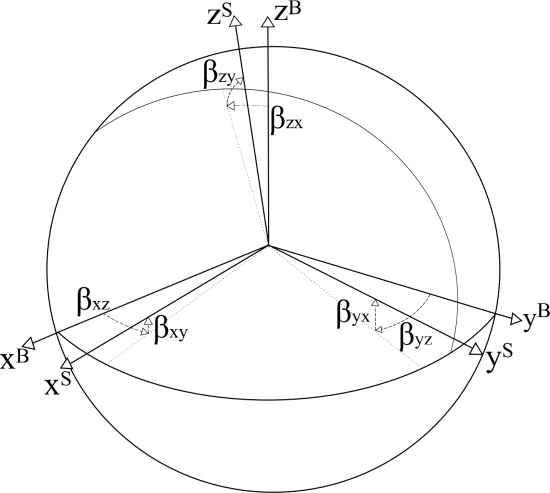

<div align="center">

# IMU Calibration & Filters
YiChun (Jim) Liao
</div>

:orange_circle:[1. Calibration](#1-calibration)\
:orange_circle:[2. Quaternion vs Euler Angles ](#2-quaternion-vs-euler-angles)\
:red_circle:[3. Complementary Filter](#3-complementary-filter)\
:orange_circle:[4. Kalman + Mahony Filter ](#4-kalman--mahony-filter)\
:orange_circle:[5. EKF (Extended Kalman filter) with 6 axis](#5-ekf-extended-kalman-filter-with-6-axis)\
:red_circle:[6. EKF with 9 axis](#6-ekf-with-9-axis)
<div align="center">

## 1. Calibration 
We use a 6 axis IMU which can be seperate into 2 different sensor, gyroscope and accelerometer.\
We assume the IMU is orthogonal.

If the IMU is not orthogonal, we need to fix that



```math 
\Large \tag*{}s^B = Ts^S, T= \begin{bmatrix}
1&-\beta_{yz}&\beta_{zy}\\
\beta_{xz}&1& -\beta_{zx}\\
-\beta_{xy}&\beta_{yx}&1\\
\end{bmatrix}
``` 
##
For accelerometer, we set $\beta_{xz}, -\beta_{xy}, \beta_{yx}$ zero: 
```math
\Large \tag*{}
a^O = T^aa^S, T^a= \begin{bmatrix}
1& -\alpha_{yz}&\alpha_{zy}\\
0&1& -\alpha_{zx}\\
0&0&1\\
\end{bmatrix}
```
##
For gyro scope, follow the $s^B$ we got:
```math 
\Large \tag*{} \omega^O = T^g\omega^S, T^g= \begin{bmatrix}
1& -\gamma_{yz}& \gamma_{zy}\\
\gamma_{xz}&1& -\gamma_{zx}\\
-\gamma_{xy}& \gamma_{yx}&1\\
\end{bmatrix}
``` 
##

We have bias for both gyro scope and accelerometer.
we can find the zero offset by these formula.

```math
\Large \tag*{} \begin{cases} b^g = \frac{1}{N}\sum_{i=1}^{N} \omega^{bias}_i \\
 b^a = \frac{1}{N}\sum_{i=1}^{N} a^{bias}_i
 \end{cases}
```
##
They can be shown in matrix format:
```math
\Large \tag*{}
\begin{cases} 
b^g = \begin{bmatrix} 
b^g_x & b^g_y & b^g_z\\
\end{bmatrix}^T \\
b^a = \begin{bmatrix} 
b^a_x & b^a_y & b^a_z\\
\end{bmatrix}^T
\end{cases}
```
##
Sensor sensitivity (Scale factor) can be found by many ways.\
For gyroscope, [1] have a great explain for how to get it with some algorithm.\
For accelerometer, I calibrate the sensitivity by this formula. 
```math
\Large \tag*{} s_a = \frac{g}{\sqrt{a_x^2 + a_y^2 + a_z^2}}
```

Where g is the gravity.

Note: If we want a better calibration for sensitivity, we will need to measure several angles to get 3 axis data for each sensor. 
##
Ending up get these matrix:

```math
\Large \tag*{} K^g = \begin{bmatrix} 
s^g_x   & 0     & 0\\
0       & s^g_y & 0\\
0       & 0     & s^g_z
\end{bmatrix}
```

```math
\Large \tag*{} K^a = \begin{bmatrix} 
s^a_x   & 0     & 0\\
0       & s^a_y & 0\\
0       & 0     & s^a_z
\end{bmatrix}
```

## 2. Quaternion vs Euler angles
### Euler Angle
I used Euler angles and ending up have a huge gimbal lock problem. \
For Euler angles is repersented with pitch, roll, and yaw.
The rotation matrix for Euler angle is shown below:

```math
\Large \tag*{} \begin{aligned}R=R_{z}(\alpha )\,R_{y}(\beta )\,R_{x}(\gamma )& \
={\overset {\text{yaw}}{\begin{bmatrix}\cos \alpha &-\sin \alpha &0\\\sin \alpha &\cos \alpha &0\\0&0&1\\\end{bmatrix}}}{\overset {\text{pitch}}{\begin{bmatrix}\cos \beta &0&\sin \beta \\0&1&0\\-\sin \beta &0&\cos \beta \\\end{bmatrix}}}{\overset {\text{roll}}{\begin{bmatrix}1&0&0\\0&\cos \gamma &-\sin \gamma \\0&\sin \gamma &\cos \gamma \\\end{bmatrix}}}
\end{aligned}
```
```math
\Large \tag*{}
={\begin{bmatrix}\cos \alpha \cos \beta &\cos \alpha \sin \beta \sin \gamma -\sin \alpha \cos \gamma &\cos \alpha \sin \beta \cos \gamma +\sin \alpha \sin \gamma \\\sin \alpha \cos \beta &\sin \alpha \sin \beta \sin \gamma +\cos \alpha \cos \gamma &\sin \alpha \sin \beta \cos \gamma -\cos \alpha \sin \gamma \\-\sin \beta &\cos \beta \sin \gamma &\cos \beta \cos \gamma \\\end{bmatrix}}
```
##
### Quaternion
Quaternion is great to simplfy compute process. Also it doesn't have a gimbal lock problem. 

[[3]](https://krasjet.github.io/quaternion/quaternion.pdf) is a really good and detail turtorial for quaternion (Chinese).
##
The represented form of quaternion:

```math
\Large \tag*{} q = q_r + q_ii + q_jj + q_kk
```
```math
\Large \tag*{} (q_r,q_i,q_j,q_k\in R)
```

This is unit quaternion. Therefore, 
```math
\Large \tag*{} q_r^2 + q_i^2 + q_j^2 + q_k^2 = 1
```
##
Quaternion-derived rotation matrix: 
<div id="2.1"></div>

```math 
\Large \tag{2.1}
R =\begin{bmatrix}
1-2s(q_j^2+q_k^2) & 2s(q_iq_j-q_kq_r) & 2s(q_iq_k+q_jq_r)\\
2s(q_iq_j+q_kq_r) & 1-2s(q_i^2+q_k^2) & 2s(q_jq_k-q_iq_r)\\
2s(q_iq_k-q_jq_r) & 2s(q_jq_k+q_iq_r) & 1-2s(q_i^2+q_j^2)
\end{bmatrix}
```
Where $\Large s = \left\| q \right\|^{-2} = 1^{-2}$ When q is a unit quaternion.
Also, 
```math
\Large \tag*{} q_r = cos(\frac{1}{2} \theta), q_i = sin(\frac{1}{2} \theta)u_x, q_j = sin(\frac{1}{2} \theta)u_y, q_z = sin(\frac{1}{2} \theta)u_z
```
##
We need the quaternion differentiation of q for the angular speed $\frac{dq}{qt} = \dot{q} = \frac{1}{2}\Omega q$

```math
\Large \tag*{} \Omega = \begin{bmatrix}
0           & -\omega_x & -\omega_y & -\omega_z\\
\omega_x    & 0         & \omega_z  & -\omega_y\\
\omega_y    & -\omega_z & 0         & \omega_x\\
\omega_z    & \omega_y  & -\omega_x & 0
\end{bmatrix}
```
```math
\Large \tag*{} q_{t+\Delta t} = q_t + \dot{q} \cdot \Delta t
```
##
Quaternions to Euler angle:

```math
\Large \tag*{} \begin{bmatrix} \theta \\ \phi \\ \psi\end{bmatrix} = \begin{bmatrix} arcsin(2(q_rq_j - q_iq_k))  \\ arctan(\frac{2q_rq_k+2q_iq_j}{1-2(q_j^2q_k^2)}) \\ arctan(\frac{2q_rq_i+2q_jq_k}{1-2(q_i^2q_j^2)})\end{bmatrix}
```
##
### Gravity to angle
since $g = [0 \space 0 \space 1]^T$, when imu is not accelerating, we get:
```math
\Large \tag*{} h(q) = R \cdot g = \begin{bmatrix}
2(q_iq_k-q_jq_r) \\
2(q_jq_k+q_iq_r) \\
1-2(q_i^2+q_j^2)
\end{bmatrix} = \begin{bmatrix}
2(q_iq_k-q_jq_r) \\
2(q_jq_k+q_iq_r) \\
q_r^2 - q_i^2 - q_j^2 + q_k^2
\end{bmatrix} = \begin{bmatrix}
a_x \\
a_y \\
a_z
\end{bmatrix}
```
## 3. Complementary Filter


## 4. Kalman + Mahony Filter

Pros: Low cost, easy to use\
Cons: not that accurate compare to EKF

Mahony filter have a major disadvantage is it used measure acceleration as the real gravity. 
This makes it have a huge error when accelerating. BY using EKF, we can predict the gravity 
and use it as the data of gravity to Mahony filter.

Gyro scope will give us if the change of gravity comming from acceleration or angle change.
By this, we can know if we should use the data from accelerometer.
##
Define the state estimate be the gravity which we want to predict
```math 
\Large \tag*{} x = \begin{bmatrix}g_x, g_y, g_z\end{bmatrix}^T 
```
##
```math
\Large \tag*{} s_k = F_kx_{k-1} + w_{k-1}
```
```math
\Large \tag*{} F_k = I + \Delta t \Omega
``` 
since $q_r$ is ignored. $\Omega$ becomes: 

```math
\Large \tag*{} \Omega = \begin{bmatrix}
0         & \omega_z  & -\omega_y\\
-\omega_z & 0         & \omega_x\\
\omega_y  & -\omega_x & 0
\end{bmatrix}
```
```math
\Large \tag*{} F_k = \begin{bmatrix} 1         & \omega_z \Delta t  & -\omega_y \Delta t \\
-\omega_z \Delta t & 1         & \omega_x \Delta t \\
\omega_y \Delta t  & -\omega_x \Delta t  & 1  \end{bmatrix}
```

```math
\Large \tag*{} z = \begin{bmatrix} 
a_x\\ a_y \\ a_z \end{bmatrix}
```
```math
\Large \tag*{} z_k = H_kx_k + v_k
```

```math
\Large \tag*{} H_k = \begin{bmatrix} 
1&0&0\\ 0&1&0 \\ 0&0&1 \end{bmatrix}
```

Where: \
$x_k$ is state estimate.\
$z_k$ is true state.

$w_k $ is the process noise.\
$v_k $ is the observation noise. 

$Q_k$ is the covariance of the process noise. \
$R_k$ is the covariance of the observation noise.

$F_k$ is state transition model. \
$B_k$ is control-input model. (We don't use it here) \
$H_k$ is observation model.

Ending up I choose not to use this filter. 

## 5. EKF (Extended Kalman filter) with 6 axis

With EKF we can predict from differentiable functions. We don't need to find a linear function for it.

From [5] we can get a EKF model. Vary similar to the one for KF. Also from [6] shows this algorithm is really good. 

In [7], it shows a similar algorithm with a 6 axis IMU which is what we want. 

I will use this one for our IMU. 
##

First, define quaternion data set
```math
\Large \tag*{} x = \begin{bmatrix} q \end{bmatrix} = \begin{bmatrix} q_r\\ q_i \\ q_j \\ q_k \end{bmatrix}
```
##
Define state transition model:
```math
\Large \tag*{} f(x_k) = \begin{bmatrix} q_k + \frac{1}{2}(\Omega_k) \Delta t q_k \end{bmatrix}
```
##
Define state transition model:
```math 
\Large \tag*{} h(q) = R \cdot g = \begin{bmatrix}
2(q_iq_k-q_jq_r) \\
2(q_jq_k+q_iq_r) \\
1-2(q_i^2+q_j^2)
\end{bmatrix} = \begin{bmatrix}
2(q_iq_k-q_jq_r) \\
2(q_jq_k+q_iq_r) \\
q_r^2 - q_i^2 - q_j^2 + q_k^2
\end{bmatrix}
```
##
Then Find the Jacobian of $f(x_k)$ and $h(x_k)$, $F_k$ and $H_k$, by MATLAB.
```objectivec
syms q0 q1 q2 q3;
syms gx gy gz;
syms dt;
x = [q0;q1;q2;q3];
omega_x = gx;
omega_y = gy;
omega_z = gz;
Omega = [0 -omega_x -omega_y -omega_z;
         omega_x 0 omega_z -omega_y;
         omega_y -omega_z 0 omega_x;
         omega_z omega_y -omega_x 0];
Q = [q0;q1;q2;q3];
f = [Q + 0.5*Omega*Q*dt];
F = simplify(jacobian(f,x))

h = [2*(q1*q3 - q0*q2);
     2*(q2*q3 + q0*q1);
     q0^2 - q1^2 - q2^2 + q3^2];
H = simplify(jacobian(h,x))
```
## 
### How EKF Works
#### Init
1. Define the $x$ (You can use any value for initial )
2. Define Q (process noise)amd R (observation noise) 
3. 


## 6. EKF with 9 axis  


## Citation
[1]. Tedaldi, David, et al. “A robust and easy to implement method for IMU calibration without external equipments.” 2014 IEEE International Conference on Robotics and Automation (ICRA), May 2014, pp. 3042–3049, https://doi.org/10.1109/icra.2014.6907297. 

[2]. Mahony, Robert, et al. “Nonlinear complementary filters on the Special Orthogonal Group.” IEEE Transactions on Automatic Control, vol. 53, no. 5, June 2008, pp. 1203–1218, https://doi.org/10.1109/tac.2008.923738. 

[3]. Krasjet. “Krasjet: A Brief Introduction to the Quaternions and Its Applications in 3D Geometry.” GitHub, https://github.com/Krasjet/quaternion. Accessed 7 Feb. 2025. 

[4]. Yamagishi, Shunsei, and Lei Jing. “The unscented Kalman filter with reduced computation time for estimating the attitude of the attitude and heading reference system.” IEEE Journal of Indoor and Seamless Positioning and Navigation, vol. 2, 2024, pp. 320–332, https://doi.org/10.1109/jispin.2024.3509801. 

[5]. Nonami K, Kendoul F, Suzuki S, et al. Autonomous Flying Robots: Unmanned Aerial Vehicles and Micro Aerial Vehicles[M]. Springer Publishing Company, Incorporated, 2010.

[6]. 基于飞控的姿态估计算法详解 - across的文章 - 知乎
https://zhuanlan.zhihu.com/p/87254101

[7]. 四元数EKF姿态更新算法 - 韭菜的菜的文章 - 知乎
https://zhuanlan.zhihu.com/p/454155643
